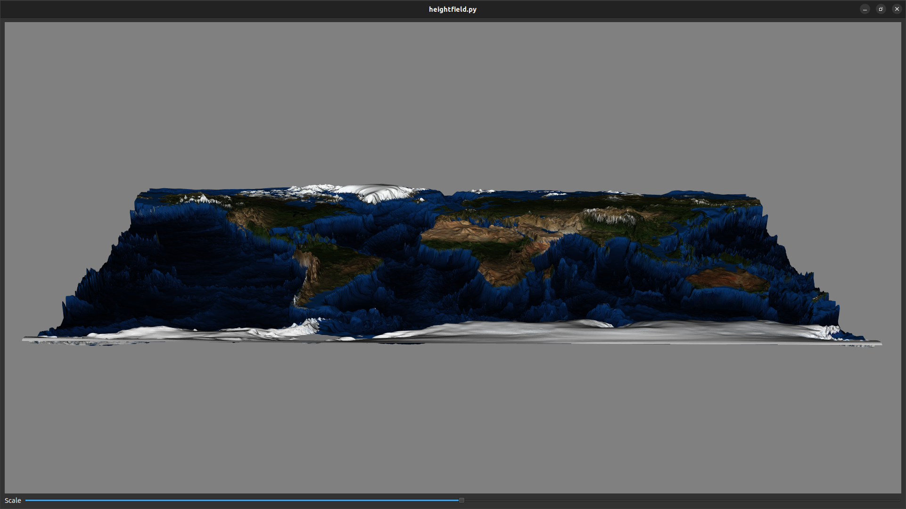

# Report

See [README.md](README.md) for instructions on how to run the application.

## Task 1. Height Map Visualization and Texture Mapping

### High Scale Factor

### Medium Scale Factor

### Low Scale Factor

### Close-Up

## Task 2. Isocontours

### Close-Up

## Task 3. Complete Visualization on a Sphere

### High Scale Factor

### Medium Scale Factor

### Low Scale Factor

### Location 1

### Location 2

### Location 3

### Location 4

### With Contour

### Without Contour

### Close-Up

## Discussion

Considering the height map technique used in Task 1:

### 1. Which properties of the dataset were effectively visualized with this technique?

The altitude of the terrain is visualized with this technique. We can see the
mountainous regions and the valleys in 3D space. Also, the scale factor can be
used to control the level of detail of the visualization.

### 2. What are, in your opinion, the main limitations of this technique, and how could you address them?

The world is not flat, so the height map technique is stretched and not accurate
enough to represent the terrain. We could use a sphere to represent the world
and use the height map technique to visualize the terrain.

### 3. How useful did you find the slider interface in your usage of the height field representation?

It provides a convenient way to control the height of the terrain. It is useful
to emphasize the mountainous regions and the valleys by increasing or decreasing
the scale factor.

### 4. How effective do you find this visualization technique for this dataset?

It is definitely effective for the world and height map dataset as it turns a 2D
image into a 3D model.

Considering the level sets considered in Task 2:

### 1. Which specific aspects of the data were readily visible with isocontours?

The slope of the terrain is readily visible with isocontours. We can see the
steep and shallow slopes in the mountain, river, and valley regions.

Considering the sphere representation in Task 3:

### 1. What benefits did you see to the perform the visualization on a sphere?

The sphere representation is a better way to model the earth as the world is not
flat. It provides a more accurate visualization of the terrain without warping
the texture and height map.

### 2. How did the resulting visualization compare to the previous ones?

The resulting visualization is more accurate than the previous ones, especially
in the polar regions.

Considering your findings in tasks 1, 2, and 3:

### 1. Did you find that the combined use of these visualization techniques in Task 3 improved the results of each method applied separately? Why or why not?

I think it is not necessary to combine the visualization techniques in Task 3 as
it adds complexity to the visualization. The 3D height map technique is
sufficient to visualize the terrain and is more intuitive than isocontour.
However, if it is hard to control the angle of the camera due to a lack of an
appropriate hardware input/support, the isocontour technique would be easier to
visualize the slope of the terrain without interacting with the camera.
